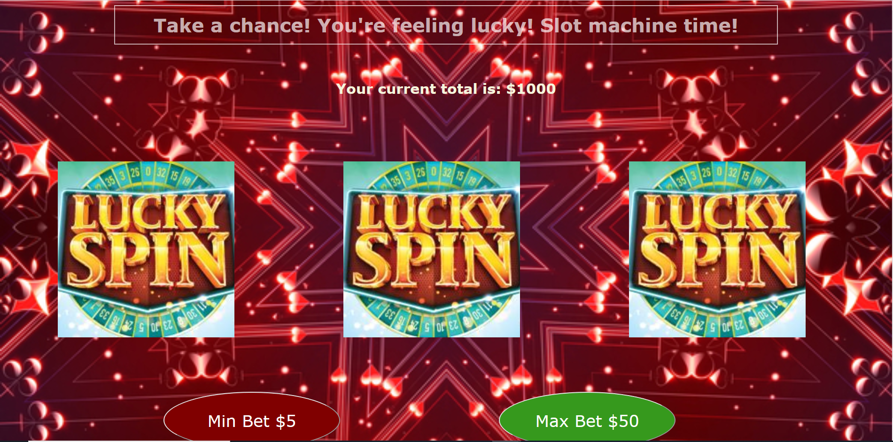

# SlotMachineExpress
Slot Machine that keeps track of score from database

How I made this: 
-Set up a simple server that's connected to a MongoDB database
-Created buttons on the page which when pressed would activate event listeners
-Event listener determined a win or lose based on random number generation
-Event listener calls the server with put request and tells it to update the database
-Server takes value from request body and uses it to set a new value to the database
-Browser JS concurrently updates the DOM to reflect the change

To Run: 
-Clone this repo
-run npm install
-run node server.js
-go to localhost:5000

